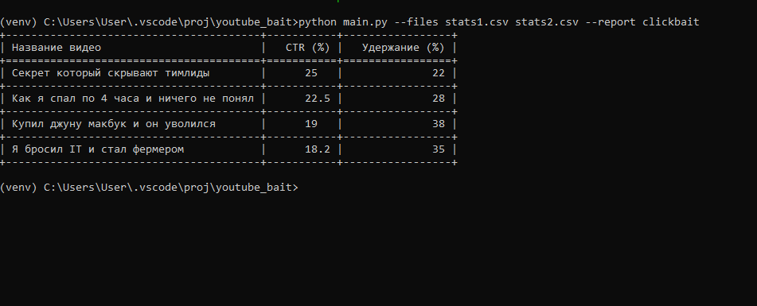
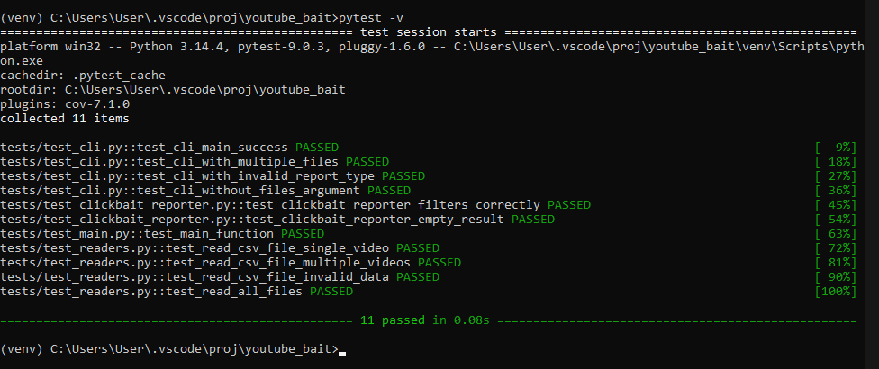
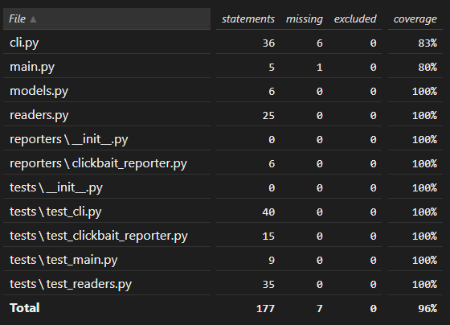

# Генератор отчётов по видео на YouTube

CLI приложение для анализа метрик YouTube видео и генерации отчётов.

## Особенности

* Анализ CSV‑файлов с данными о видео (CTR, удержание аудитории).
* Генерация отчётов по заданным критериям.
* Поддержка типа отчёта `clickbait`.
* Удобный интерфейс командной строки (CLI) с понятными сообщениями об ошибках.
* Полное покрытие тестами (все тесты пройдены).

## Установка

1. Перейдите в папку проекта. Выберите подходящий вариант:
**Если вы уже находитесь в родительской директории**:
```bash
cd youtube_bait
```
Если нужно указать полный путь (универсальный способ):
```cmd
cd C:\полный\путь\к\вашему\проекту\youtube_bait
```
2. Создайте виртуальное окружение:
```bash
python -m venv venv
```
3. Активируйте виртуальное окружение:
* **Windows (cmd):**
```cmd
venv\Scripts\activate
```
Linux/macOS (bash):
```bash
source venv/bin/activate
```

4. Установите зависимости:
```bash
pip install -r requirements.txt
```

## Использование

```bash
python main.py --files stats1.csv stats2.csv --report clickbait
```

## Параметры

--files — один или несколько путей к CSV‑файлам с данными о видео. Обязательный параметр.

--report — тип отчёта для генерации. На текущий момент доступен только clickbait. Обязательный параметр.

## Примеры

1. Анализ одного файла
```bash
python main.py --files stats1.csv --report clickbait
```

2. Анализ нескольких файлов
```bash
python main.py --files stats1.csv stats2.csv --report clickbait
```

## Формат входных данных
Программа ожидает CSV‑файлы со следующими колонками:

title — название видео;

ctr — CTR (Click‑Through Rate, %) видео;

retention_rate — процент удержания аудитории.

## Пример строки CSV:

csv
title,ctr,retention_rate
"Моё крутое видео",4.5,78.2

## Вывод отчёта
Отчёт выводится в табличном формате в консоли (с использованием tabulate). Пример:

+----------------------+-------+------------+
| Название видео     | CTR (%) | Удержание (%) |
+==================+=======+============+
| Моё крутое видео   | 4.5   | 78.2       |
+----------------------+-------+------------+

Если данных для отображения нет, выводится сообщение: Нет данных для отображения.

## Типы отчётов

На текущий момент поддерживается один тип отчёта:

clickbait — анализирует видео на признаки кликбейта (например, высокий CTR при низком удержании).

## Обработка ошибок

Программа выводит понятные сообщения об ошибках и использует коды выхода:

Код 1 — неизвестный тип отчёта.

Код 2 — файл не найден.

## Запуск тестов

Чтобы запустить набор тестов:

```bash
pytest -v
```
Чтобы проверить покрытие кода тестами:

```bash
pytest --cov=. --cov-report=html
```

После выполнения последней команды откроется папка htmlcov/, где можно просмотреть подробный отчёт в браузере.

## Скриншоты работы программы

1. **Запуск и генерация отчёта:**


2. **Результаты запуска тестов:**


3. **Отчет о покрытии кода тестами:**

